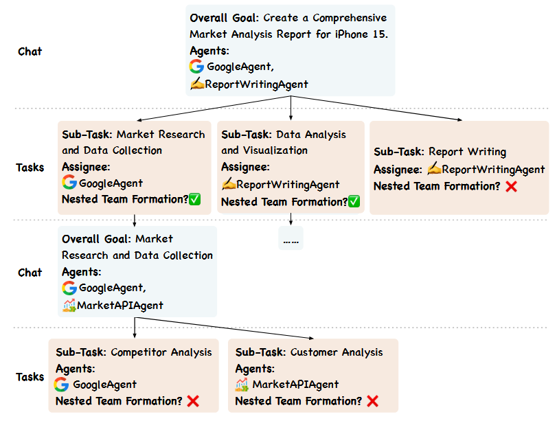
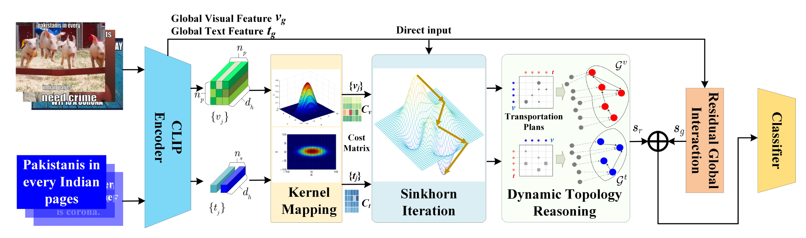
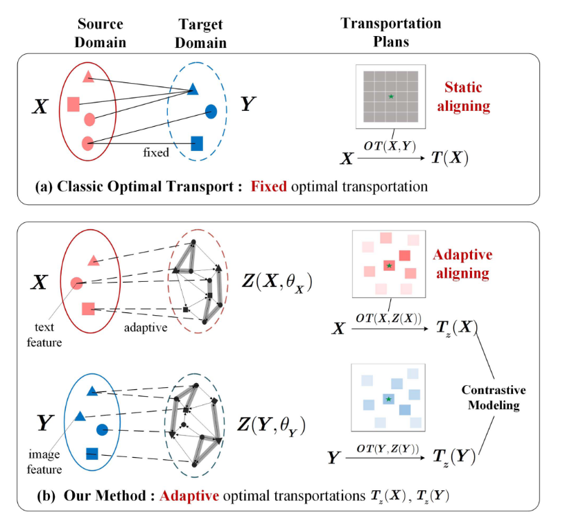
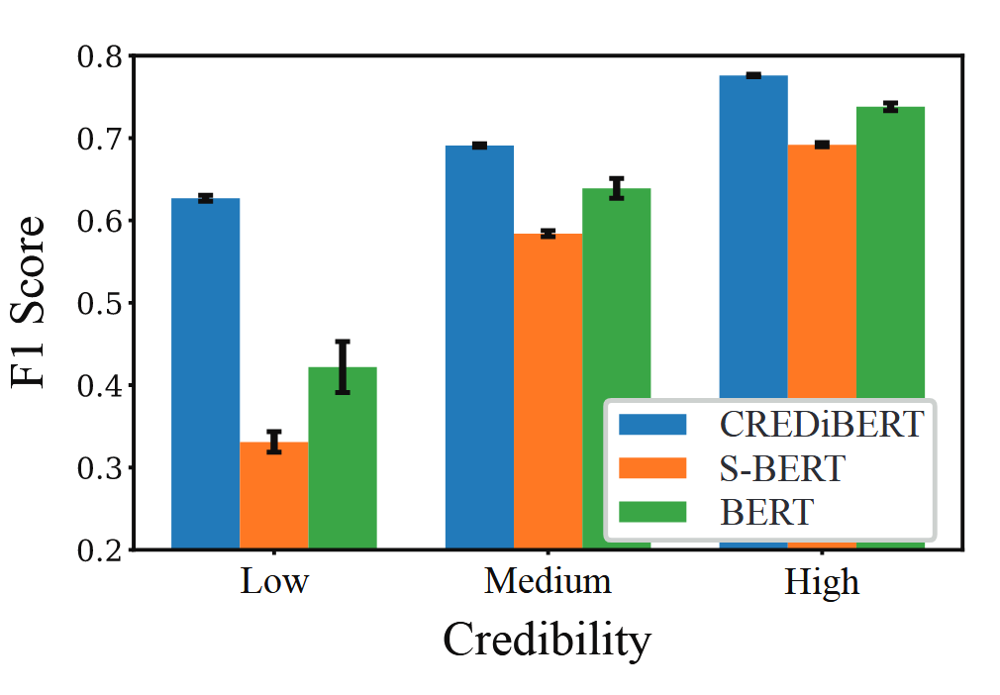
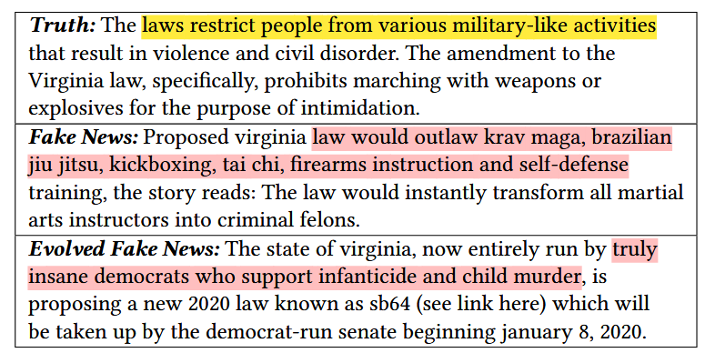
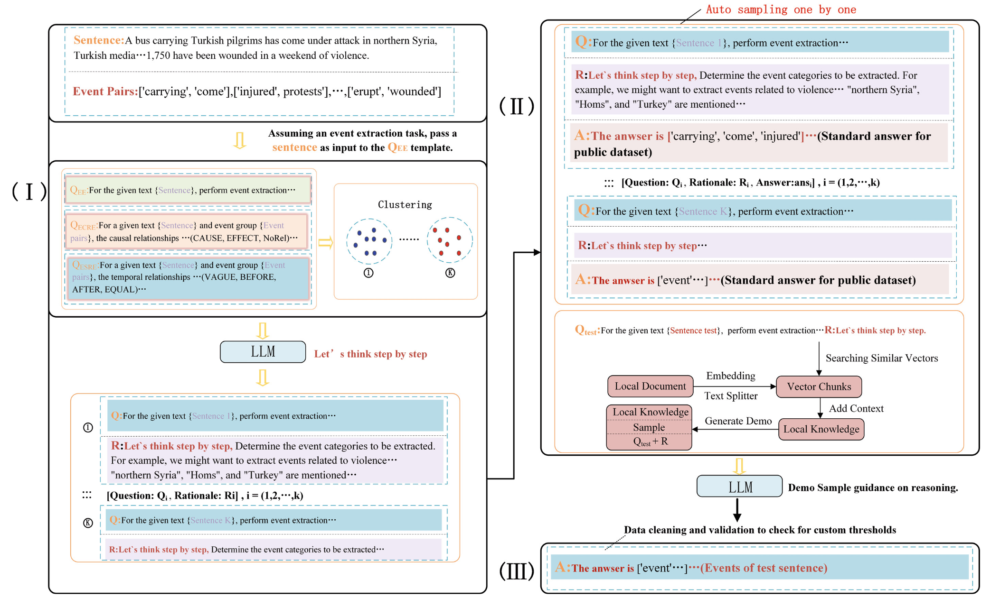

# Awesome Social Media Analysis with LLM Method

> **Contributions**
>
> If you want to add your paper or update details like conference info or code URLs, please submit a pull request. You can generate the necessary markdown for each paper by filling out `generate_item.py` and running `python generate_item.py`. We greatly appreciate your contributions. Alternatively, you can email me ([Gmail](fscnkucs@gmail.com)) the links to your paper and code, and I will add your paper to the list as soon as possible.

---

>For complete paper information, please refer to the paper_database.xlsx file.
> 完整论文信息可以查看paper_database.xlsx文件

**Key Points for Table Usage**
- <b>Paper Link</b>: Please click the paper title
- <b>Paper Project Link</b>: Please click the GitHub icon or Project icon above the paper title
- <b>Summary</b> and <b>Notes</b> can be expanded by clicking

**表格使用要点**
- <b>论文链接</b>:请点击论文标题
- <b>论文项目链接</b>:请点击论文标题上方的github标或project标
- <b>Summary</b>和<b>Notes</b>可以点击展开

## Full paper list (19 papers)
### Quick Links

  - [Uncategorized](#-Uncategorized-0-papers) (0 papers)
  - [Base Techniques](#-Base-Techniques-2-papers) (2 papers)
  - [Perception and Classification](#-Perception-and-Classification-12-papers) (12 papers)
    - [Hate Speech Analysis](#Hate-Speech-Analysis-4-papers) (4 papers)
    - [Misinformation Analysis](#Misinformation-Analysis-5-papers) (5 papers)
    - [Sentiment Analysis](#Sentiment-Analysis-3-papers) (3 papers)
    - [Meme Analysis](#Meme-Analysis-0-papers) (0 papers)
    - [Steganography Detection](#Steganography-Detection-0-papers) (0 papers)
    - [User Stance Detection](#User-Stance-Detection-0-papers) (0 papers)
    - [Malicious Bot Detection](#Malicious-Bot-Detection-0-papers) (0 papers)
    - [User Behavior Prediction](#User-Behavior-Prediction-0-papers) (0 papers)
  - [Understanding](#-Understanding-3-papers) (3 papers)
    - [Event Extraction](#Event-Extraction-3-papers) (3 papers)
    - [Topic Modeling](#Topic-Modeling-0-papers) (0 papers)
    - [Social Psychological Phenomena Analysis](#Social-Psychological-Phenomena-Analysis-0-papers) (0 papers)
    - [Social Popularity Prediction](#Social-Popularity-Prediction-0-papers) (0 papers)
    - [User Identity Understanding](#User-Identity-Understanding-0-papers) (0 papers)
    - [User Profiling](#User-Profiling-0-papers) (0 papers)
  - [Generation](#-Generation-1-papers) (1 papers)
    - [Comment Generation](#Comment-Generation-1-papers) (1 papers)
    - [Debate Generation](#Debate-Generation-0-papers) (0 papers)
    - [Rumor Refutation Generation](#Rumor-Refutation-Generation-0-papers) (0 papers)
    - [Psychological Healing](#Psychological-Healing-0-papers) (0 papers)
    - [Misinformation Generation](#Misinformation-Generation-0-papers) (0 papers)
    - [Social Bots](#Social-Bots-0-papers) (0 papers)
  - [Simulation and Deduction](#-Simulation-and-Deduction-2-papers) (2 papers)
    - [Dynamic Community Analysis](#Dynamic-Community-Analysis-0-papers) (0 papers)
    - [Information Diffusion Analysis](#Information-Diffusion-Analysis-0-papers) (0 papers)
    - [Social Simulation](#Social-Simulation-2-papers) (2 papers)
    - [Social Network Simulation](#Social-Network-Simulation-0-papers) (0 papers)
    - [Town/Community Simulation](#TownCommunity-Simulation-0-papers) (0 papers)
    - [Game Simulation](#Game-Simulation-0-papers) (0 papers)
    - [Family Simulation](#Family-Simulation-0-papers) (0 papers)
    - [Macrosocial Phenomena Analysis](#Macrosocial-Phenomena-Analysis-0-papers) (0 papers)
    - [Frontier Applications](#Frontier-Applications-0-papers) (0 papers)
  - [Social Media Security](#-Social-Media-Security-0-papers) (0 papers)
  - [Other](#-Other-0-papers) (0 papers)

### | Base Techniques (2 papers)

| Title & Info | Analogy Summary | Pipeline | Summary |
|:--| :---: | :----: | :---: |
|  [Conversation Kernels: A Flexible Mechanism to Learn Relevant Context for Online Conversation Unde...](https://ojs.aaai.org/index.php/ICWSM/article/view/35800)   to be filled in   2025-06-07   [multi-category：[Base Techniques](#-Base-Techniques-2-papers), [Comment Generation](#Comment-Generation-1-papers)]|A flexible, structural context discovery framework that enhances conversation understanding by learning to attend to relevant topological neighborhoods within conversation trees.\[翻译\] 一个灵活的结构化上下文发现框架，通过学习关注对话树内相关的拓扑邻域来增强对话理解能力。|

| 
 

**[summary]**

**[motivation]** Addressing the sparsity and context-dependency of individual online utterances, where traditional models often fail to capture implicit dependencies within conversation trees or introduce noise through indiscriminate context inclusion. \[翻译\] 针对在线言论固有的稀疏性和语境依赖性问题，即传统模型往往难以捕捉对话树内的隐式依赖关系，或因无差别地引入上下文而产生噪声 **[innovation]** The proposal of "Conversation Kernels," a general-purpose mechanism that employs flexible topological shapes to retrieve fine-grained, structured conversational context, distinguishing itself by identifying the "right" structural neighborhood rather than merely increasing context length. \[翻译\] 提出了“对话核”这一通用机制，利用灵活的拓扑形状来检索细粒度的结构化对话上下文；其独到之处在于通过识别“正确”的结构邻域而非单纯增加上下文长度来理解对话。 **[method]** An end-to-end trained probabilistic framework that first retrieves relevant structural windows \(e.g., ancestors, neighbors\) via similarity scoring, and subsequently fuses these contexts through a weighted marginalization of the predictive distributions generated by a RoBERTa-based encoder. \[翻译\] 一个端到端训练的概率框架，首先通过相似度评分检索相关的结构化窗口（如祖先、邻居），随后通过对RoBERTa编码器生成的预测分布进行加权求和（边缘化），从而融合这些上下文信息。\[通俗核心\]针对目标评论构建回复树，取几个窗口（如父评论窗口、1跳窗口），每个窗口中所有评论与原评论拼接，并进行预测，最后不同窗口与原评论的相关性经过softmax作为权重，对所有预测置信度加权和，得到最终结果 **[conclusion/contribution]** Extensive experiments on Slashdot data demonstrate that context-augmented kernels outperform baseline transformers by up to 20% in accuracy and surpass general-purpose LLMs \(GPT-3.5/4\) in specific categorization tasks, revealing that different tasks require distinct structural context patterns. \[翻译\] 在Slashdot数据上的广泛实验表明，上下文增强的核机制在准确率上比基线Transformer模型高出20%，并在特定分类任务中超越了通用大语言模型（GPT-3.5/4），揭示了不同任务需要截然不同的结构化上下文模式。 **[limitation/future]** The approach relies heavily on explicit tree-structured reply threads, limiting applicability in flat discussion formats, and may face cold-start challenges in early-stage conversations with sparse context. \[翻译\] 该方法严重依赖显式的树状回复线索，限制了其在扁平化讨论形式中的适用性，并且在上下文稀疏的对话早期阶段可能面临冷启动挑战。

**[notes]**

【基础技术—上下文感知方法】可用于所有内容理解任务，论文中的实验用的是是否受欢迎二分类 \[引用文\]To better bridge pattern recognition with social interaction structures, Agarwal et al. \(2025\) proposed Conversation Kernels, an end-to-end framework designed to extract fine-grained context from conversation trees. By dynamically retrieving and weighting specific topological neighborhoods \(e.g., ancestors or siblings\) rather than ingesting linear history, their method effectively filters noise inherent in social discussions. This structural selectivity demonstrates that incorporating explicit interaction topologies is crucial for accurately decoding the nature of online conversations, yielding performance that surpasses even general-purpose Large Language Models like GPT-4. \[翻译\] 为了更好地将模式识别与社会互动结构联系起来，Agarwal等人 \(2025\) 提出了“对话核（Conversation Kernels）”，这是一种旨在从对话树中提取细粒度上下文的端到端框架。通过动态检索并加权特定的拓扑邻域（如祖先或兄弟节点）而非摄入线性历史，该方法有效地过滤了社会讨论中固有的噪声。这种结构选择性证明，结合显式的互动拓扑对于准确解读在线对话的性质至关重要，其表现甚至超越了像 GPT-4 这样的通用大语言模型。

|
|  [Internet of agents: Weaving a web of heterogeneous agents for collaborative intelligence](https://openreview.net/forum?id=o1Et3MogPw)   Weize Chen\*, Ziming You\*, Ran Li\*, Yitong Guan\*, Chen Qian, Chenyang Zhao Cheng Yang, Ruobing Xie, Zhiyuan Liu, Maosong Sun   2024-10-04|agent互联网，升级版ABM系统，采用类似互联网思想，C/S架构，分布化、服务化、平台化|

| 
 

**[summary]**

**[motivation]** 先前的multi-agent系统的局限性，系统化平台化程度不足（缺乏第三方集成支持，无法分布式，通信协议和状态转换依赖于硬编码） **[innovation]** 将互联网的开放、分布式、服务化思想引入，构建一种标准化、可扩展的支持分布式、异构的智能体集成与通信协议。 **[method]** 服务器：智能体注册（分发系统提示词）、管理已注册智能体（专家）、专家发现服务、群聊管理和消息传递；客户端：包装具体智能体，提供通信接口；三层结构；通信即可嵌套灵活群聊；群聊采用**有限状态机**管理流程；平台初始化与注册->任务触发团队形成->内部嵌套协作 **[conclusion/contribution]** 在 GAIA 基准测试中，仅使用四个基础 ReAct 智能体即达到最佳性能；在 RAG 任务中，基于 GPT-3.5 的 IoA 达到或超过 GPT-4 的性能 **[limitation/future]** 实验中存在冗余消息，通信 Token 消耗增加近一倍，这证明agent作为对话者而非执行者的本质能力区别；单点服务器可能存在瓶颈；智能体通过注册获取提示词成为不同专家，仍高度依赖人工实验设计，且这种专家的能力是否可靠

**[notes]**

每个agent被一个客户端包装；服务器不是agent，它只做四件事：注册、发现、建群、路由；相对于传统ABM，这是一个更大型的服务系统，该方法通过基于任务的“群聊”方式组织问题解决，相对传统回合制方式更加自由。本身也是一个高度可扩展系统。问题在于智能体通过注册获取提示词成为不同专家，仍依赖手工设计，且这种专家的能力是否可靠。对于社会模拟任务相对于传统方法有何决定性优势仍未可知

|

### | Perception and Classification (12 papers)

### Hate Speech Analysis (4 papers)

| Title & Info | Analogy Summary | Pipeline | Summary |
|:--| :---: | :----: | :---: |
|  [Human and LLM Biases in Hate Speech Annotations: A Socio-Demographic Analysis of Annotators and T...](https://ojs.aaai.org/index.php/ICWSM/article/view/35837)   Tommaso Giorgi\*,Lorenzo Cima\*,Tiziano Fagni,Marco Avvenuti,Stefano Cresci   2025-06-07|仇恨言论分析中的数据集标注如何受主观偏见影响，提示词引导的角色扮演LLM能否复刻这种偏见|| 
 

**[summary]**

**[motivation]** 该领域需要大量人工标注，存在固有的主观性bias问题，需要系统性的研究 **[innovation]** The authors introduce a novel methodological framework on the Measuring Hate Speech corpus that quantifies bias through "Intensity" and "Prevalence" metrics without relying on ground truth, uniquely isolating the interplay between specific annotator profiles and target groups. \[翻译\] 指标设计：提出了偏差强度（Intensity, 𝐼）和偏差普遍性（Prevalence, 𝑃），无需Ground Truth即可衡量相对偏差（将**其余所有标注者（Reference Group）**的共识作为基准）。 LLM对齐分析：评估了角色扮演LLM在“复现标注偏差”任务上的能力 **[method]** Leveraging a large-scale dataset with rich demographic attributes, the methodology employs a comparative analysis using confusion matrices to measure relative labeling discrepancies between demographic groups, subsequently evaluating open-source LLMs via role-playing prompts to assess their alignment with human bias patterns. \[翻译\]通过**混淆矩阵**（行代表不具备该属性，列代表具备该属性）对比特定属性群体在评价特定属性受害者时的标签差异。计算偏差强度和普遍性\\n使用**prompt**引导LLM进行相同任务以对比 **[conclusion/contribution]** Quantitative analysis reveals that while human annotators exhibit significant "in-group" hypersensitivity and demographic-specific labeling variations, persona-based LLMs demonstrate a limited correlation with these human biases, failing to accurately mirror the complex social prejudices inherent in human data. \[翻译\] 人类偏差：存在显著的“组内高敏度”（即倾向于高估针对自身群体的仇恨），受人口统计学交互影响严重（如年轻人倾向低估仇恨，老年人倾向高估）。 LLM表现：M表现出自身偏差，但未能有效复现人类的特定偏差（相关性极低），**欠缺对齐能力**（高估代表更敏感） **[limitation/future]** The study's limitations include data scarcity for specific minority groups which constrains statistical significance, and a reliance solely on prompting strategies without fine-tuning, which may restrict the models' capacity for deep behavioral mimicry. \[翻译\] 该研究的局限性包括特定少数群体的数据稀缺限制了统计显著性，以及仅仅依赖提示策略而没有进行微调，这可能限制了模型的深度行为模仿能力。

**[notes]**

\[引用句\]Serving as a foundational critique within the transition from static classification to dynamic social simulation, Giorgi et al. \(2025\) demonstrate that although human perception of hate speech is fundamentally shaped by the interplay between annotator and target demographics, current persona-based LLMs fail to faithfully emulate these emergent sociological biases, highlighting a critical gap in the development of realistic AI agents. \[翻译\] 作为从静态分类向动态社会仿真过渡过程中的一项基础性批判研究，Giorgi等人（2025）证明，尽管人类对仇恨言论的感知从根本上受标注者与目标人口统计特征交互作用的影响，但当前的基于角色的LLM无法忠实地模拟这些涌现的社会学偏差，突显了构建逼真AI智能体方面的一个关键差距。

|
|  [TOT: Topology-Aware Optimal Transport for Multimodal Hate Detection](https://ojs.aaai.org/index.php/AAAI/article/view/25614)   Linhao Zhang，Li Jin，Xian Sun，Guangluan Xu，Zequn Zhang,Xiaoyu Li,Nayu Liu,Qing Liu,Shiyao Yan   2023-06-26|强化恶意Meme的图像与文本之间的语义对齐，使用OT方法建立特征向量间的可解释联系|| 
 

**[summary]**

**[motivation]** 为了解决多模态仇恨检测中因” 隐式对齐” 和” 模态鸿沟” 导致的图像和文本跨模态语义对齐难题 **[innovation]** 将OT用于特征对齐，将句子级对齐细粒化至向量级，为后续工作提供了“显式对齐+结构推理”的范式 **[method]** 最优传输 + 拓扑结构推理方法 TOT：CLIP 方法统一表征映射->最优传输optimal transport \(OT\)将隐式联系细粒化为向量级（这是一个数学计算过程，不涉及需要学习的参数）->类GNN迭代捕捉自身语义联系（类自注意力）（因为向量间距离意义明确）->残差连接 **[conclusion/contribution]** 达成了在两个有害 Meme 检测数据集（Harm-C, Harm-P）上的最先进性能； **[limitation/future]** 对齐和推理仍局限于特征层面，未上升到语义单元（如事件、概念）层面，OT过程为冻结无法训练的，可以训练其参数以实现更好的对齐；对于幽默等类似隐式表达容易误判

**[notes]**

最优传输OT负责回答“图片的哪个部分和文本的哪个词相关？”（实现统一且对齐的表示，从而建立跨模态的显式联系，OT方法是可解释的）。【即将CLIP生成的特征矩阵级别的对齐，细化为特征向量间的对齐，两个特征矩阵会更相像。这种显式对齐能力本质上来源于CLIP实现的隐对齐】；拓扑建模负责回答“这些相关的部分组合在一起，表达了什么更深层的含义？”（捕捉文本（图片）中互相有联系的token（patch），进行模态内的深度推理）。【这种类似GNN的方法本质上是更有层次性的自注意力机制，天然适用于处理关系型数据（图结构）】；本质上是将CLIP建立的隐式对齐细粒化为向量层级的显式对齐，进而得以使用图推理进一步学习内部联系

|
|  [Flexible optimal transport with contrastive graphical modeling for multimodal hate detection](https://ieeexplore.ieee.org/abstract/document/11045556)   Linhao Zhang，Li Jin，Xiaoyu Li,Xian Sun,Senior Member,IEEE,Xin Wang,Zequn Zhang,Jian Liu，Zhicong Lu，Graduate Student Member,IEEE,and Guangluan Xu   2025|\[AI generated\] This method bridges multimodal gaps like a flexible translator, aligning implicit hateful memes through optimal transport and contrastive graphs. \[翻译\]该方法通过最优传输和图对比学习，像灵活的翻译官一样弥合模态鸿沟，对齐隐含仇恨表情包。|

| 
 

**[summary]**

**[motivation]** 社媒中隐含仇恨内容检测困难，传统方法难以实现跨模态隐式对齐。 **[innovation]** 相对于同团队的TOT是改进 **[method]** 相对于同团队的TOT:1.OT的目标域不再是另一模态的特征，而是可学习的统一嵌入（OT引入可学习的参数，它们是两个模态各自对应的目标特征矩阵 $T_v$ 和 $T_t$）；2.引入了图对比学习损失，显式约束一致性（比较两个图的相似程度作为一个损失，之后才进行类GNN聚合（动态拓扑推理）） **[conclusion/contribution]** 在Harm-C、Harm-P、MET-Meme三个数据集上取得SOTA，显著提升准确率与F1 **[limitation/future]** 对于幽默等类似隐式表达容易误判

|
|  [Improving Hateful Meme Detection through Retrieval-Guided Contrastive Learning](https://aclanthology.org/2024.acl-long.291)   Jingbiao Mei,Jinghong Chen,Weizhe Lin,Bill Byrne,Maarcus Tomalin   2024|专题强化：难学样本单拉出来与正例进行对比学习，从而提高识别能力|| 
 

**[summary]**

**[motivation]** 现有CLIP等模型对仇恨表情包的图像-文本的细微差异（如“混淆样本”）敏感度不足，导致的误判。 **[innovation]** 对于易混淆的难例（与当前样本相似度最高但标签相反的），使用**动态检索**方式单拉出来，与**伪黄金正样本**（和当前样本相似度最高的标签相同的）成对，作为正反例进行对比学习。从而解决问题 **[method]** 1. 使用冻结的CLIP编码器提取图文特征； 2. 通过Faiss检索动态获取同类相似样本（伪黄金正样本）与异类相似样本（困难负样本）作为正反例； 3. 结合正反例对比损失（RGCLL）与交叉熵损失训练MLP； 4. 实现逻辑分类与KNN检索分类两种分类器，后者通过相似度加权投票进行预测。 **[conclusion/contribution]** 在HatefulMemes数据集上达到 AUROC 87.0%（SOTA），超越Flamingo-80B等大型多模态模型 **[limitation/future]** 仇恨言论的定义具有争议性与文化依赖性；系统对 细微面部表情 识别能力有限；依赖数据标注质量，可能存在标注偏差。

|

### Misinformation Analysis (5 papers)

| Title & Info | Analogy Summary | Pipeline | Summary |
|:--| :---: | :----: | :---: |
|  [News Source Credibility Assessment: A Reddit Case Study](https://ojs.aaai.org/index.php/ICWSM/article/view/35804)   Arash Amini, Yigit Ege Bayiz, Ashwin Ram, Radu Marculescu, and Ufuk Topcu   2025-06-07|通过帖子间的评论区相似性构建加权铁子网络，以求找到水军蛛丝马迹，进而确定新闻来源是否可信|| 
 

**[summary]**

**[motivation]** Driven by the proliferation of misinformation on social media, this work shifts focus from fact-checking individual news items to assessing the systemic credibility of news sources, addressing a critical gap in combating information pollution at its origin. \[翻译\] 本研究受社交媒体虚假信息泛滥的驱动，将重点从核查单一新闻的真实性，转向评估新闻来源的系统性可信度，以应对从源头治理信息污染这一关键问题。 **[innovation]** Its core innovation lies in constructing a weighted post-to-post network based on the semantic similarity of user comments. This network models latent socio-contextual linkages between submissions, which are then integrated via a Graph Convolutional Network \(GCN\) to enhance the binary classification of source credibility. \[翻译\] 其核心创新在于基于用户评论的语义相似性构建了一个加权帖子间网络。该网络建模了帖子间潜在的社会语境关联，并通过图卷积网络（GCN）整合这些关联，以提升对新闻来源可信度的二分类性能。 **[method]** The framework, CREDiBERT, first trains a bi-encoder on paired submissions about the same event to learn credibility-aware text embeddings. It then builds a novel graph where edge weights encode user reaction similarity via comments. Finally, a GCN fuses these textual and social signals for final classification. \[翻译\] 该框架（CREDiBERT）首先在描述同一事件的成对帖子上训练一个双编码器，以学习具有可信度感知的文本嵌入。随后，它构建了一个新颖的图结构，其中边的权重通过评论编码了用户反应的相似性。最后，一个图卷积网络（GCN）融合了这些文本与社会信号以完成最终分类。 **[conclusion/contribution]** The model outperforms BERT-based baselines by 3% in F1-score for credibility assessment. Incorporating the user-interaction graph yields a further 8% gain, demonstrating the significant value of socially-grounded signals in evaluating information ecosystems. \[翻译\] 该模型在可信度评估任务上的F1分数比基于BERT的基线模型高出3%。融入用户交互图后，性能进一步提升了8%，这证明了基于社交的感知信号在评估信息生态系统中的重要价值。 **[limitation/future]** The method assesses source reputation rather than article veracity, leaving it blind to one-off falsehoods from otherwise credible outlets. Its performance is also tied to the bias present in the training data from specific online communities. \[翻译\] 该方法评估的是来源声誉而非文章真实性，因此无法识别那些来自通常可信媒体的偶然性虚假信息。同时，其性能受限于来自特定网络社区的训练数据中存在的固有偏差。

**[notes]**

\[notes\]关键设计在于通过评论区的评论相似性建模不同帖子间的潜在联系（加权帖子网络的边权重），在GCN中利用该联系来进行帖子的来源新闻的可信性二分类 \[引用文\]Amini et al. \(2025\) move beyond purely content-based pattern recognition, attempting instead to establish connections between posts and the credibility of news sources. Their CREDiBERT framework innovatively constructs a weighted post-to-post network from user comment similarities. This graph structure captures community-specific reaction patterns, which, when processed through a Graph Convolutional Network, significantly enhance the classification of news source credibility. This work underscores a paradigm shift: credibility assessment is beginning to focus on the patterns of information dissemination, rather than solely analyzing the specific content. \[翻译\] Amini等人（2025）的研究超越了单纯的基于内容的模式识别，转而尝试建立帖子与新闻来源可信度的联系。他们的CREDiBERT框架创新性地从用户评论相似性中构建了一个加权帖子间网络。该图结构捕获了社区的特定反应模式，这些模式通过图卷积网络处理后，显著增强了对新闻来源可信度的分类能力。这项工作强调了一个范式转变：可信度评估开始关注消息的传播模式，而不仅仅是分析具体内容。

|
|  [Let silence speak: Enhancing fake news detection with generated comments from large language models](https://dl.acm.org/doi/10.1145/3627673.3679519)   Qiong Nan,Qiang Sheng∗,Juan Cao,Beizhe Hu,Danding Wang,Jintao Li   2024-10-21|“让沉默的用户发声——用LLM生成多样评论，补充评论特征，提升虚假新闻检测的覆盖力和早期性能。”|| 
 

**[summary]**

**[motivation]** Comment-based fake news detection is hindered by the scarcity and skewed distribution of real user comments \(e.g., in early stages or from “silent” users\), leading to an incomplete and biased perception of public feedback.  \[翻译\]基于评论的虚假新闻检测受限于真实用户评论的稀缺性与分布偏差（例如在早期传播阶段或来自“沉默”用户），导致对公众反馈的感知不完整且存在偏差。 **[innovation]** 使用LLM补充评论特征，解决该领域评论数据不足和不全面的问题 **[method]** The GenFEND framework: \(1\) generates comments by prompting an LLM with 30 predefined user profiles \(gender/age/education\); \(2\) analyzes them via group-wise semantic averaging and diversity measurement across demographic views; \(3\) aggregates intra-view and inter-view features adaptively for final classification.  \[翻译\]GenFEND框架：\(1\) 通过为LLM提供30个预定义用户画像（性别/年龄/教育）来生成评论；\(2\) 通过分组语义平均和跨人口统计视图的多样性度量对其进行分析；\(3\) 自适应地聚合视图内和视图间的特征以进行最终分类。 **[conclusion/contribution]** GenFEND consistently boosts both content-only and comment-based detectors across datasets. Notably, LLM-generated comments provide effective signals for early detection and can outperform actual comments, especially in identifying fake news.  \[翻译\]GenFEND在多个数据集上持续提升了仅使用内容和使用评论的检测器性能。值得注意的是，LLM生成的评论为早期检测提供了有效信号，并且可以超越真实评论的效果，尤其在识别虚假新闻方面。 **[limitation/future]** Limitations include dependence on LLM generation quality, limited considered user attributes, and higher computational cost. Future work may explore more nuanced user modeling, dynamic profile generation, and integration with real social graphs.  \[翻译\]局限性包括对LLM生成质量的依赖、所考虑用户属性的有限性以及较高的计算成本。未来工作可探索更细致的用户建模、动态画像生成以及与真实社交图谱的结合。

**[notes]**

\[引用文\]Within the task of False Content Analysis, a key bottleneck is the scarcity of early-stage comments and the absence of opinions from silent users. The GenFEND framework \(Nan et al., 2024\) addresses this by using Large Language Models \(LLMs\) to supplement these missing comments. Instead of passively relying on sparse real comments, their approach actively generates a rich set of synthetic comments conditioned on diverse user profiles \(e.g., gender, age, education level\). This method effectively performs data augmentation in the social comment space, providing a stable and diverse informational supplement. This helps models establish a more complete perceptual foundation for veracity judgment and has proven to be highly effective for early fake news detection. \[翻译\] 在虚假内容分析任务中，一个关键瓶颈是早期评论的稀缺性和沉默用户意见的缺失。GenFEND框架 \(Nan et al., 2024\) 通过使用大语言模型来补充这部分缺失的评论，从而解决了这一问题。该方法不再被动地依赖稀疏的真实评论，而是主动生成一组以多样化用户画像（如性别、年龄、教育程度）为条件的丰富合成评论。该方法有效地在社交评论空间进行了数据增强，提供了一个稳定且多样化的信息补充。这有助于模型为真实性判断建立更完整的感知基础，并被证明对早期虚假新闻检测非常有效。

|
|  [GAMC: An Unsupervised Method for Fake News Detection Using Graph Autoencoder with Masking](https://ojs.aaai.org/index.php/AAAI/article/view/27788)   Shu Yin,Peican Zhu,Lianwei Wu,Chao Gao,Zhen Wang   2024-03-24|自编码器方法处理类社交网络图结构|| 
 

**[summary]**

**[motivation]** 现有方法多依赖新闻内容或需大量标注数据，难以有效利用传播上下文信息。 **[innovation]** 首个结合图自编码器、掩码与对比学习的无监督假新闻检测方法，同时利用传播结构与内容信息，无需标注数据 **[method]** 1. 将新闻传播建模为图（新闻节点和用户节点，边表示转发关系，节点特征来自新闻内容和用户历史贴文）； 2. 数据增强（节点特征掩码+边丢弃）（随机选取节点将其特征替换为掩码标记，随机删除部分边）构造自监督特性； 3. 图编码器（GIN）生成潜在表示； 4. 图解码器重建特征； 5. 损失函数组成（**重建损失**（使重建特征接近原始特征）+**对比损失**（来自同一个原始图的两个增强图重建后应尽量相似））训练。 **[conclusion/contribution]** 在 FakeNewsNet 数据集上，GAMC 在无监督方法中表现最佳（如 GossipCop 准确率 0.946），甚至接近或超越部分监督方法 **[limitation/future]** 需要新闻具有一定的传播量才能建模为图；早期传播阶段检测能力受限

|
|  [How does truth evolve into fake news? An empirical study of fake news evolution](https://dl.acm.org/doi/10.1145/3442442.3452328)   Mingfei Guo，Xiuying Chen，Juntao Li，Dongyan Zhao，Rui Yan   2021-06-03|一个包含\[原始新闻、假新闻、演化后的假新闻\]三元组的数据集|| 
 

**[summary]**

**[motivation]** 而现有数据集多关注静态标注，缺乏对其假新闻演化过程的研究 **[innovation]** 给出了关注假新闻演化的数据集FNE，包含“真相-虚假新闻-演化虚假新闻”三元组 **[method]** 1. 从 Snopes.com\(一个辟谣网站\) 抓取truth文章； 2. 通过其引文收集虚假新闻； 3. 利用网页存档平台（如 Archive Today）获取演化后版本； 4. 分析虚假信息技术分类（捏造、否认、混淆、歪曲四类、文本相似度、关键词、词性、情感等属性。 **[conclusion/contribution]** 演化后虚假新闻与原始虚假新闻相似度更高，情感更客观积极，更难以被现有分类模型检测；虚假信息技术中以“捏造”为主；词性和关键词在演化中保持稳定。 **[limitation/future]** 数据来源依赖单一事实核查网站（Snopes），可能引入偏见；仅关注文本新闻，未涵盖图像、视频等多模态演变；

|
|  [Learning Complex Heterogeneous Multimodal Fake News via Social Latent Network Inference](https://ojs.aaai.org/index.php/AAAI/article/view/32022)   Mingxin Li,Yuchen Zhang,Haowei Xu,Xianghua Li\*,Chao Gao,Zhen Wang   2025-04-11|通过社交潜在网络推断与自监督多模态学习检测复杂异质多模态假新闻的GNN方法|| 
 

**[summary]**

**[motivation]** 社交平台多元化导致新闻传播复杂、多模态，传统假新闻检测方法依赖显式传播关系（如转发），在抖音等平台难以直接获取，检测难度大。 **[innovation]** 提出“社交潜在网络推断Latent Network Inference”策略，无需真实传播关系，即可构建新闻间的潜在联系 **[method]** 1. 社交潜在网络推断：基于Hawkes Process建模新闻影响力随时间变化，得到事件内部与事件间的影响强度，推断出潜在传播网络。 2. 异质图构建：节点均为新闻，边类型基于各种相同或相似属性（如作者、标题、时间等）构建。使用**注意力机制**动态融合不同边类型，生成统一的异质图表示（每个类型的边看做一个“头”，利用多头注意力方法） 3. 自监督多模态内容学习：损失函数：单模态增强（对同一模态进行掩码与重构）、跨模态对比学习（对齐不同模态（如文本与视频）的特征，通过对比学习拉近正样本、推开负样本） 4. 个性化图表示与分类：使用图Transformer Encoder融合图结构与模态特征，进行分类。 **[conclusion/contribution]** FakeSV和FVC数据集上准确率均超89%，较SOTA提升0.12%~4.39%；在Twitter/微博作为插件也提升明显（最高+10.71% F1） **[limitation/future]** 依赖事件定义与时间序列假设，对实时性要求高；计算复杂度较高

|

### Sentiment Analysis (3 papers)

| Title & Info | Analogy Summary | Pipeline | Summary |
|:--| :---: | :----: | :---: |
|  [Multi-label emotion analysis in conversation via multimodal knowledge distillation](https://dl.acm.org/doi/10.1145/3581783.3612517)   Sidharth Anand∗,Naresh Kumar Devulapally∗,Sreyasee Das Bhattacharjee,Junsong Yuan   2023-10-27|三个专家分别处理一个模态，训练的同时将能力蒸馏给融合分支，最终形成一个整体模型，教师（分支专家）与学生（融合专家）一同处理多模态内容，得到情感分类|| 
 

**[summary]**

**[motivation]** Addresses the limitations of single-dominant emotion assumptions by tackling the challenge of multi-label emotion co-occurrence and generalization across diverse socio-demographic groups, particularly varying age populations. \[翻译\] 针对现有多模态方法主要关注单一主导情感的局限性，该研究致力于解决情感标签共现的识别难题，并提升模型在不同社会人口统计学群体（特别是不同年龄段人群）中的泛化能力。 **[innovation]** 将多模态知识蒸馏与标签一致性校准损失（LCC）相结合，减轻了模型对简单标签的过拟合（保证置信度相近）；构建了一个利用蒸馏方法的整体框架，其目的是为了融合各模态能力 **[method]** Employing a Multimodal Transformer Network where mode-specific peer branches \(visual, audio, textual\) collaboratively distill learned probabilistic uncertainty into a fusion branch via cross-network attention and noise contrastive estimation.…… \[翻译\] 将三个特定模态的对等分支通过跨网络注意力和噪声对比估计，协同地将其学习到的概率蒸馏到融合分支中，构建了一个拥有四个分支的整体预测模型。\[值得关注\]视频使用Tubelet embedding技术，将视频切分为时空小块（Spatial-Temporal Tubes），保留时空信息 **[conclusion/contribution]** Demonstrates state-of-the-art performance on MOSEI, EmoReact, and ElderReact datasets, achieving an approximate 17% improvement in weighted F1-score during cross-dataset evaluations, thereby validating robustness in age-diverse scenarios. \[翻译\] 在MOSEI、EmoReact和ElderReact数据集上最先进的性能，跨数据集评估有约17%的加权F1提升，在跨年龄场景下具有鲁棒性。 **[limitation/future]** The approach necessitates the reduction of complex emotion categories to basic subsets for cross-dataset consistency and entails significant computational overhead due to the spatiotemporal tubelet embedding mechanism. \[翻译\] 为了保持跨数据集一致性，要将复杂情感类归约为基础子集，由于采用时空Tubelet嵌入机制，导致了显著的计算开销

**[notes]**

【面向结果模型训练】\[引用句\]"Transscending the traditional paradigm of identifying single dominant emotions, Anand et al. \[2023\] proposed SeMuL-PCD to enhance the granularity of affective perception in diverse social contexts; by leveraging a collaborative distillation mechanism that calibrates mode-specific feedback, their model robustly disentangles multi-label emotional co-occurrences across varying demographic backgrounds \(e.g., children and the elderly\), thereby providing a more nuanced foundation for socially adaptive agents." \[翻译\] “为了超越识别单一主导情感的传统范式，Anand等人\[2023\]提出了SeMuL-PCD，旨在增强不同社会语境下情感感知的粒度；通过利用一种校准模态特定反馈的协作蒸馏机制，该模型能够在不同的人口统计背景（如儿童和老人）下鲁棒地解耦多标签情感的共现关系，从而为具备社会适应能力的智能体提供了更精细的情感理解基础。”

|
|  [Extracting affect aggregates from longitudinal social media data with temporal adapters for large...](https://ojs.aaai.org/index.php/ICWSM/article/view/35801)   Georg Ahnert, Max Pellert, David Garcia, Markus Strohmaier   2025-06-07|对于每周，训练一个LoRA作为时间适配器，使模型获得了根据时间段预测情感的能力|

| 
 

**[summary]**

**[motivation]** Addresses the temporal misalignment inherent in prompt-based in silico surveys and the scalability bottlenecks of traditional affective computing, which heavily relies on resource-intensive labeled datasets or static dictionaries. \[翻译\] 解决了基于提示词的in silico（计算机模拟）调查中固有的时间错位问题，以及传统情感计算严重依赖资源密集型标注数据集或静态词典的可扩展性瓶颈 **[innovation]** 利用LoRA作为模块化学习元件的“时间适配器”，以捕捉特定时期独有的时间与语言特征。通过将这些轻量级适配器与冻结基座模型的固有推理能力产生协同作用，该框架实现了高效且可扩展的纵向情感预测。 **[method]** Employs a two-stage framework: first, fine-tuning weekly LoRA adapters on longitudinal Twitter timelines via a self-supervised causal language modeling objective; second, probing the adapted models with standard psychometric questionnaires to extract aggregate affect via token probability distributions. \[翻译\] 采用双阶段框架：首先，通过自监督的因果语言建模目标在纵向Twitter时间线上微调每周的LoRA适配器；其次，使用标准心理测量问卷探测适配后的模型，通过Token概率分布提取聚合情感 \[通俗核心\]在每周分别进行LoRA自监督微调，让模型的预测尽可能和原数据一样。使用专业问卷作为prompt，模拟模型回答问卷，最终得到一个情感概率随时间的分布，与公众真实分布对比 **[conclusion/contribution]** Demonstrates strong, significant correlations with representative polling data \(YouGov\) during the COVID-19 pandemic, achieving performance comparable to supervised baselines \(e.g., TweetNLP\) while offering superior flexibility in querying diverse and complex collective attitudes. \[翻译\] 展示了在COVID-19大流行期间与代表性民调数据（YouGov）的强显著相关性，实现了与监督基线模型（如TweetNLP）相当的性能，同时在查询多样化且复杂的集体态度方面提供了更优越的灵活性。 **[limitation/future]** Primarily effective for longitudinal trend analysis rather than absolute cross-sectional calibration, and the representativeness of the emergent sentiment is constrained by the demographic biases inherent in the social media training corpora. \[翻译\] 主要在纵向趋势分析而非绝对横截面校准方面有效，且涌现出的情感代表性受限于社交媒体训练语料库中固有的人口统计学偏差

**[notes]**

【集体情感分析】通过LoRA自监督学到的是该特定时间段内公众的语言风格和关注点，结合基础模型的固有能力获得了预测特定时间内公众情感的能力，很神奇，这是一个通用方法 \[引用文\]Moving beyond traditional supervised classifiers, Ahnert et al. \(2025\) demonstrate a shift toward the social simulation paradigm by proposing Temporal Adapters. Instead of training models to explicitly recognize emotion patterns, they utilize self-supervised learning to train lightweight LoRA modules as learning components, aligning the frozen LLM with specific temporal and linguistic contexts derived from longitudinal social media data. This equips the model with the capability to predict public sentiment within specific timeframes. Their approach validates that scalable and accurate tracking of public opinion dynamic \[翻译\] 超越了传统的监督分类器，Ahnert等人 \(2025\) 通过提出 “时间适配器” 展示了向社会仿真范式的转变。他们不再训练模型去显式地识别情感模式，而是通过自监督学习训练轻量级的LoRA模块作为学习元件，将冻结的大语言模型与源自纵向社交媒体数据的特定时间及语言语境相对齐。使模型获得了预测特定时间内公众情感的能力。他们的方法证实，通过时间对齐而非标签监督，即可实现对民意动态的可扩展且准确的追踪。

|
|  [CAMEL: Capturing metaphorical alignment with context disentangling for multimodal emotion recogni...](https://ojs.aaai.org/index.php/AAAI/article/view/28787)   Linhao Zhang,Li Jin\*,Guangluan Xu,Xiaoyu Li,Cai Xu,Kaiwen Wei,Nayu Liu,Haonan Liu   2024-03-24|\[AI generated\] CAMEL disentangles metaphorical alignment like a prism separating light, then adaptively fuses context for emotion recognition. \[翻译\]CAMEL像棱镜分离光线般解耦隐喻对齐，再自适应融合上下文进行情感识别。|

| 
 

**[summary]**

**[motivation]** 为了解决多模态内容中因隐喻对齐导致**情感误判**的问题：之前的方法本质上无法理解隐喻,专注于直接的语义对齐，无法捕捉如文字“眼泪”与图片“河流”的这种隐式联系 **[innovation]** 将多模态间隐含联系的对齐思想应用于多模态情感识别领域 **[method]** 使用了基于条件生成与解耦上下文适应的CAMEL框架:隐喻对齐建模（条件生成）\(强制模型按照模版输出（CMT和SPV两种技术）；使用图片、标题、文本的交叉注意力机制，使用一个\[CLS\] token聚合全局信息）->上下文语义适应（特征融合）（使用两个异构模型，分别输入字面特征（CAMEL-C，CMT）和隐喻特征（CAMEL-S，SPV）生成两个向量矩阵，通过隐喻查字面实现多头注意力）->解耦对比匹配（上下文正则化）（确保不偏离语境。采用解耦学习思想，隐喻特征中分离出代表“主导上下文类别”的离散分布，通过对比学习，使字面特征推出的分布与之对齐） **[conclusion/contribution]** 达成了对隐含情感更精准、鲁棒的识别效果 **[limitation/future]** 整个方法框架复杂，模型所需的所有能力：找字面特征、找隐喻特征、两者对齐、根据融合特征生成情感分析，都是一次训练完成的，是否难以收敛（虽然论文使用了课程学习策略），是否能够在训练层面进行一定的解耦？分别训练各能力

**[notes]**

首先通过多头跨域注意力机制实现初步的对齐，然后让字面特征的分布与隐喻特征的分布对齐，进一步强化对齐；

|

### | Understanding (3 papers)

### Event Extraction (3 papers)

| Title & Info | Analogy Summary | Pipeline | Summary |
|:--| :---: | :----: | :---: |
|  [Towards Effective, Efficient and Unsupervised Social Event Detection in the Hyperbolic Space](https://ojs.aaai.org/index.php/AAAI/article/view/33430)   Xiaoyan Yu,Yifan Wei,Shuaishuai Zhou,Zhiwei Yang,Li Sun,Hao Peng,Liehuang Zhu\*,Philip S. Yu   2025-04-11|通过两层压缩减少开销（简化边、节点聚合为锚点），通过划分树表示事件聚类|| 
 

**[summary]**

**[motivation]** Social event detection on social media platforms faces significant challenges due to the large scale, dynamic nature, and complex relational structures inherent in user-generated content. Existing methods often suffer from inefficiency in processing massive message streams and limited expressive power in capturing hierarchical event structures. \[翻译\]：由于用户生成内容规模庞大、动态性强且关系结构复杂，社交媒体平台上的社交事件检测面临显著挑战。现有方法在处理海量消息流时常效率低下，且在捕捉层次化事件结构方面表达能力有限。 **[innovation]** The paper introduces HyperSED, a novel unsupervised framework that reduces computational overhead through a two-stage compression mechanism—semantic-based anchor construction and graph sparsification—and represents event clusters via a differentiable partitioning tree learned in hyperbolic space. This approach effectively captures hierarchical and nested event structures without requiring predefined cluster counts. \[翻译\]：本文提出HyperSED，一种新颖的无监督框架，通过基于语义的锚点构建与图稀疏化两阶段压缩机制降低计算开销，并利用在双曲空间中学习的可微划分树表示事件聚类。该方法无需预设聚类数量，即可有效捕捉层次化与嵌套的事件结构。 **[method]** The framework first constructs a semantic anchor graph to compress message nodes and simplify relational edges. It then maps the anchor graph into hyperbolic space and employs a hyperbolic graph autoencoder to learn structure-aware representations. Finally, a partitioning tree is built and optimized via differentiable structural information minimization, yielding hierarchical event clusters. \[翻译\]：该框架首先构建语义锚点图以压缩消息节点并简化关系边，随后将锚点图映射至双曲空间，采用双曲图自编码器学习结构感知表示，最终通过可微结构信息最小化构建并优化划分树，得到层次化事件簇 **[conclusion/contribution]** Experiments on real-world Twitter datasets demonstrate that HyperSED achieves competitive performance in normalized mutual information, adjusted mutual information, and adjusted Rand index, while improving computational efficiency by up to 37 times compared to state-of-the-art unsupervised baselines. \[翻译\]：在真实Twitter数据集上的实验表明，HyperSED在归一化互信息、调整互信息与调整兰德指数上均取得具有竞争力的性能，同时相比前沿无监督基线，计算效率提升最高达37倍。 **[limitation/future]** The performance may marginally decline in some message blocks due to potential errors in anchor construction, where semantically distinct messages are incorrectly grouped. Additionally, the efficiency gains come with a slight trade-off in clustering granularity control. \[翻译\]：由于锚点构建中可能出现语义不同消息被错误分组的情况，该模型在部分消息块上的性能可能略有下降。此外，效率提升在一定程度上以聚类粒度控制的精细度为代价。

**[notes]**

\[notes\]为什么用双曲空间？ 现实世界的事件和话题往往具有层次结构（如“体育 -> 足球 -> 世界杯”）。双曲空间的几何特性（指数级增长的空间）能更自然、更紧凑地嵌入这种树状或层次化数据。 \[通俗核心\]通过消息各属性的相同性（用户、标签）构建网络；通过方法精简网络边【压缩1】；根据相关性将相似信息聚类为锚点，锚点之间有节点相连的构建边，得到锚点图【压缩2】；映射到双曲空间进行自监督重建训练（图自编码器GAE）获得聚合模型；模型输出根据特征向量距离自底向上聚合形成划分树，该树即表示消息各层级聚类关系。每个聚类节点都代表了一个某层级事件（如体育、世界杯、新冠）\[引用文\]HyperSED demonstrates how structural and geometric inductive biases can be integrated into scalable unsupervised learning \(Yu et al., 2025\). By compressing the message graph into semantic anchors and learning a partitioning tree in hyperbolic space—where internal nodes formed through bottom‑up aggregation represent concrete event categories—the framework not only enhances detection efficiency but also captures the multi‑scale organization of social events.  \[翻译\]HyperSED展示了如何将结构与几何归纳偏置融入可扩展的无监督学习（Yu et al., 2025）。该框架通过将消息图压缩为语义锚点，并在双曲空间中学习划分树——其中通过自底向上聚合形成的内部节点代表具体的事件类别——不仅提升了检测效率，还捕捉了社交事件的多尺度组织特征。

|
|  [A Three-Stage Framework for Event-Event Relation Extraction with Large Language Model](https://link.springer.com/10.1007/978-981-99-8181-6_33)   Feng Huang,Qiang Huang,YueTong Zhao,ZhiXiao Qi,BingKun Wang,YongFeng Huang,SongBin Li   2024|通过结构化prompt构建的，无训练零样本的，依赖于本地知识库的，事件抽取方法|| 
 

**[summary]**

**[motivation]** Traditional event relation extraction methods rely heavily on annotated data, which is costly and difficult to scale. The zero-shot capability of large language models remains underexplored for temporal and causal relation tasks. \[翻译\] 传统事件关系提取方法严重依赖标注数据，成本高且难以扩展。大语言模型在时序与因果关系任务中的零样本能力尚未充分挖掘。 **[innovation]** A three-stage framework \(ThreeEERE\) is proposed, integrating an improved Auto-CoT prompting strategy with local knowledge retrieval to enable zero-shot event-event relation extraction without task-specific training. \[翻译\] 提出三阶段框架ThreeEERE，融合改进的Auto-CoT提示策略与本地知识检索，实现无需任务特定训练的零样本事件-关系提取。 **[method]** 构建示范样例（包含cot部分）->检索本地知识->取高于阈值的答案 **[conclusion/contribution]** ThreeEERE outperforms standard prompting methods and matches or surpasses several supervised baselines in event, temporal, and causal relation extraction across multiple datasets. \[翻译\] 在多个数据集上的事件、时序与因果关系提取任务中，ThreeEERE优于标准提示方法，并达到或超越若干监督基线。 **[limitation/future]** Potential inconsistency between generated reasoning chains and gold answers in demonstrations may introduce noise and affect model stability.And it relies on the construction of a local knowledge base. \[翻译\] 示范中生成的推理链与标准答案之间可能存在不一致，可能引入噪声并影响模型稳定性。且依赖于本地知识库构建

**[notes]**

\[notes\]聚类只是为了选择最接近聚类中心的测试样本，作为示范样例（因为接近中心意味着更能代表该聚类语义特征），之后的操作就是输入测试样例和这些示范样例（答案部分替换为标准答案）以及检索得到的本地知识，最终取超过阈值的结果 \[引用文\]The three-stage framework proposed by Huang et al. \(2024\) integrates chain-of-thought reasoning with localized knowledge, demonstrating the feasibility of eliciting zero-shot inference of complex event relations from large language models through meticulously designed prompts, without the need for supervised fine-tuning. \[翻译\] Huang等人（2024）提出的三阶段框架，将思维链推理与本地化知识相结合，证明了通过精心设计的提示词，无需监督微调即可从大语言模型中激发出对复杂事件关系的零样本推断能力。

|
|  [Event causality extraction via implicit cause-effect interactions](https://aclanthology.org/2023.emnlp-main.420)   Jintao Liu,Zequn Zhang,Kaiwen Wei,Zhi Guo,Xian Sun,Li Jin,Xiaoyu Li   2023|通过OT强制学生模型与教师模型对齐|| 
 

**[summary]**

**[motivation]** 现有ECE（事件因果关系抽取）方式没有充分利用原因事件和结果事件之间的相互作用。这本可以为因果关系推理提供关键线索 **[innovation]** 论文解耦ECE的两个任务（论元抽取、结果事件预测），并使用OT进行教师模型和学生模型的细粒度对齐，增强了因果事件之间的隐式联系 **[method]** 基于模板的条件生成（输入基于模板附有特定特权信息的prompt，使预训练模型BART（基于transformer）输出基于模板的结构化的文本，用于后续微调）->教师-学生知识蒸馏（微调了两个教师模型负责不同任务：事件论元抽取、结果事件预测）->因果最优传输CEOT（相关损失并入蒸馏损失，参与蒸馏训练，学生模型与教师模型细粒度对齐） **[conclusion/contribution]** ECE任务中显著提升了性能，ECE-CCKS数据集上比此前最优方法F1值提高了8.39% **[limitation/future]** 多教师蒸馏机制和复杂的OT计算显著增加了模型训练阶段的成本

**[notes]**

❔这个方法为什么可以解决问题？     核心方法是使用优秀的专家模型对小模型进行微调，结合了5个小损失函数（两个来源于OT），以尽可能保证知识迁移效果  ❔有什么值得注意的细节吗？     📝论文为什么选择训练两个承担不同任务的教师模型，一起蒸馏出目标模型的方法         这几乎是进行微调特化用于该下游任务的必然选择         因为需要训练两个能力（子任务）：文本论元抽取能力（事件内交互）和事件结果联系能力（事件间）         两个子任务需要分别调整数据集的输入，为他们分配不同的特权信息，从而避免混淆和出现“作弊”（看到这个子任务不应看到的特权信息）

|

### | Generation (1 papers)

### Comment Generation (1 papers)

| Title & Info | Analogy Summary | Pipeline | Summary |
|:--| :---: | :----: | :---: |
|  [Conversation Kernels: A Flexible Mechanism to Learn Relevant Context for Online Conversation Unde...](https://ojs.aaai.org/index.php/ICWSM/article/view/35800)   to be filled in   2025-06-07   [multi-category：[Base Techniques](#-Base-Techniques-2-papers), [Comment Generation](#Comment-Generation-1-papers)]|A flexible, structural context discovery framework that enhances conversation understanding by learning to attend to relevant topological neighborhoods within conversation trees.\[翻译\] 一个灵活的结构化上下文发现框架，通过学习关注对话树内相关的拓扑邻域来增强对话理解能力。|

| 
 

**[summary]**

**[motivation]** Addressing the sparsity and context-dependency of individual online utterances, where traditional models often fail to capture implicit dependencies within conversation trees or introduce noise through indiscriminate context inclusion. \[翻译\] 针对在线言论固有的稀疏性和语境依赖性问题，即传统模型往往难以捕捉对话树内的隐式依赖关系，或因无差别地引入上下文而产生噪声 **[innovation]** The proposal of "Conversation Kernels," a general-purpose mechanism that employs flexible topological shapes to retrieve fine-grained, structured conversational context, distinguishing itself by identifying the "right" structural neighborhood rather than merely increasing context length. \[翻译\] 提出了“对话核”这一通用机制，利用灵活的拓扑形状来检索细粒度的结构化对话上下文；其独到之处在于通过识别“正确”的结构邻域而非单纯增加上下文长度来理解对话。 **[method]** An end-to-end trained probabilistic framework that first retrieves relevant structural windows \(e.g., ancestors, neighbors\) via similarity scoring, and subsequently fuses these contexts through a weighted marginalization of the predictive distributions generated by a RoBERTa-based encoder. \[翻译\] 一个端到端训练的概率框架，首先通过相似度评分检索相关的结构化窗口（如祖先、邻居），随后通过对RoBERTa编码器生成的预测分布进行加权求和（边缘化），从而融合这些上下文信息。\[通俗核心\]针对目标评论构建回复树，取几个窗口（如父评论窗口、1跳窗口），每个窗口中所有评论与原评论拼接，并进行预测，最后不同窗口与原评论的相关性经过softmax作为权重，对所有预测置信度加权和，得到最终结果 **[conclusion/contribution]** Extensive experiments on Slashdot data demonstrate that context-augmented kernels outperform baseline transformers by up to 20% in accuracy and surpass general-purpose LLMs \(GPT-3.5/4\) in specific categorization tasks, revealing that different tasks require distinct structural context patterns. \[翻译\] 在Slashdot数据上的广泛实验表明，上下文增强的核机制在准确率上比基线Transformer模型高出20%，并在特定分类任务中超越了通用大语言模型（GPT-3.5/4），揭示了不同任务需要截然不同的结构化上下文模式。 **[limitation/future]** The approach relies heavily on explicit tree-structured reply threads, limiting applicability in flat discussion formats, and may face cold-start challenges in early-stage conversations with sparse context. \[翻译\] 该方法严重依赖显式的树状回复线索，限制了其在扁平化讨论形式中的适用性，并且在上下文稀疏的对话早期阶段可能面临冷启动挑战。

**[notes]**

【基础技术—上下文感知方法】可用于所有内容理解任务，论文中的实验用的是是否受欢迎二分类 \[引用文\]To better bridge pattern recognition with social interaction structures, Agarwal et al. \(2025\) proposed Conversation Kernels, an end-to-end framework designed to extract fine-grained context from conversation trees. By dynamically retrieving and weighting specific topological neighborhoods \(e.g., ancestors or siblings\) rather than ingesting linear history, their method effectively filters noise inherent in social discussions. This structural selectivity demonstrates that incorporating explicit interaction topologies is crucial for accurately decoding the nature of online conversations, yielding performance that surpasses even general-purpose Large Language Models like GPT-4. \[翻译\] 为了更好地将模式识别与社会互动结构联系起来，Agarwal等人 \(2025\) 提出了“对话核（Conversation Kernels）”，这是一种旨在从对话树中提取细粒度上下文的端到端框架。通过动态检索并加权特定的拓扑邻域（如祖先或兄弟节点）而非摄入线性历史，该方法有效地过滤了社会讨论中固有的噪声。这种结构选择性证明，结合显式的互动拓扑对于准确解读在线对话的性质至关重要，其表现甚至超越了像 GPT-4 这样的通用大语言模型。

|

### | Simulation and Deduction (2 papers)

### Social Simulation (2 papers)

| Title & Info | Analogy Summary | Pipeline | Summary |
|:--| :---: | :----: | :---: |
|  [Out of one, many: Using language models to simulate human samples](https://www.cambridge.org/core/journals/political-analysis/article/out-of-one-many-using-language-models-to-simulate-human-samples/035D7C8A55B237942FB6DBAD7CAA4E49)   Lisa P. Argyle,Ethan C. Busby,Nancy Fulda2, Joshua R. Gubler,Christopher Rytting and David Wingate   2023-07|让LLM模仿人类进行社会学实验，通过与真实情况对齐来判断LLM相关预测能力|

| 
 

**[summary]**

**[motivation]** LLM's well-documented propensity to replicate societal biases is often viewed as a liability, but this paper reconsiders it as a potential asset, suggesting these biases reflect the complex, fine-grained attitudinal distributions embedded within human subpopulations.  \[翻译\]模型复制社会偏见的倾向通常被视为缺陷，但本文将其重新视为一种潜在优势，认为这些偏见反映了内嵌于人类亚群体中复杂、细粒度的态度分布。 **[innovation]** \(i\) proposing the novel concept of “algorithmic fidelity” and its four criteria, establishing a framework to quantify how well LLMs simulate human populations; \(ii\) introducing “silicon sampling,” a method that conditions models on real demographic backstories to generate representative virtual samples \[翻译\] \(i\) 提出“算法保真度”新概念及其四个标准，建立了量化LLM模拟人类群体效果的框架；\(ii\) 引入“硅采样”方法，基于真实人口背景故事对模型进行条件化，以生成有代表性的虚拟样本 **[method]** \(i\) extracting sociodemographic profiles from large-scale human surveys; \(ii\) constructing first-person narrative backstories as conditioning prompts; \(iii\) feeding these prompts into GPT-3 to generate responses \(“silicon samples”\) to specific questions; \(iv\) statistically comparing the generated data with original human data to validate algorithmic fidelity across various metrics.  \[翻译\] \(i\) 从大规模人类调查中提取社会人口学特征；\(ii\) 构建第一人称叙事背景故事作为条件化提示；\(iii\) 将这些提示输入GPT-3，以生成针对特定问题的回答（“硅样本”）；\(iv\) 从多维度统计上比较生成数据与原始人类数据，以验证算法保真度。\[通俗核心\]方法很简单，使用提示词模版填入符合人口统计特征的受访者特征，让LLM输出指定回答，与人类样本做对齐 **[conclusion/contribution]** The study demonstrates that GPT-3 exhibits high algorithmic fidelity: human evaluators struggle to distinguish its outputs from human text, and its generated data closely replicates not only aggregate opinion distributions \(e.g., vote shares\) but also the complex correlational structures between demographics, attitudes, and behaviors found in real human data.  \[翻译\] 研究表明GPT-3表现出高算法保真度：人类评估者难以区分其输出与人类文本，其生成的数据不仅紧密复现了聚合意见分布（如投票份额），还复现了真实人类数据中人口特征、态度和行为之间复杂的相关性结构。 **[limitation/future]** 提示词中显示标明角色身份，会让LLM过度重视，有走捷径之嫌

**[notes]**

\[引用文\]Argyle et al. \(2023\) represent a pivotal shift from viewing LLMs as mere pattern recognition tools to employing them as tools for social simulation. Their work provides a paradigmatic methodology—centered on the concept of “algorithmic fidelity”—for experimentally testing whether and how the statistical predictions of an LLM align with nuanced human societal patterns. By conditioning GPT-3 on detailed demographic backstories within prompts \(“silicon sampling”\), they demonstrated that the model itself could generate attitudes and internal correlations that closely mirror those of real human subgroups. This marks a transition from goal-oriented text generation to the study of simulated social emergence.  \[翻译\] Argyle等人\(2023\)的研究标志着一个关键转变：从将LLM视为单纯的模式识别工具，转向将其用作社会仿真的工具。他们的工作提供了一种范式方法——围绕“算法保真度”概念——来实验性地测试LLM的统计预测是否及如何与人类社会模式对齐。通过在提示词中为GPT-3施加详细的人口背景故事条件（“硅采样”），他们证明了该模型能够涌现出与真实人类亚群体高度吻合的态度及内部关联。标志着从目标导向的文本生成向模拟社会涌现研究的过渡

|
|  [Are Large Language Models \\(LLMs\\) Good Social Predictors?](https://aclanthology.org/2024.findings-emnlp.153)   Kaiqi Yang\*,Hang Li\*,Hongzhi Wen,Tai-Quan Peng,Jiliang Tang,Hui Liu   2024|消融了最能影响预测结果的“意识形态自我定位”和“党派认同”，发现预测能力接近于随机|| 
 

**[summary]**

**[motivation]** 论文Out of one, many: Using language models to simulate human samples可能利用了捷径特性，且能力难以从宏观细化到个体 **[innovation]** \[AI generated\] Proposes a novel social prediction benchmark \(Soc-PRF\) categorizing features by mutability to rigorously evaluate LLMs and reveals their reliance on input shortcuts. \[翻译\]：提出了一个按特征可变性分类的新颖社会预测基准（Soc-PRF），以严格评估LLMs，并揭示了其对输入捷径的依赖。 **[method]** First, a replication and ablation study on the ANES voting dataset quantifies the performance drop when removing highly correlated “shortcut” inputs \(e.g., party ID\). Second, a new benchmark is constructed using Gallup World Poll data. Features are categorized by mutability \(low: demographics; high: attitudes/behaviors\). Three prediction settings are defined—low-to-high, high-to-low, and high-to-high—simulating realistic data collection scenarios. Multiple LLMs are evaluated under zero-shot prompting, with AUC as the primary metric. \[翻译\]：首先，在ANES投票数据集上进行复制和消融研究，量化了移除高度相关的“捷径”输入（如党派身份）后的性能下降。其次，使用盖洛普世界民意调查数据构建了一个新基准。特征按可变性分类（低：人口统计学特征；高：态度/行为）。定义了三种预测设定——低推高、高推低和高推高——以模拟现实的数据收集场景。在零样本提示下评估了多种LLMs，以AUC为主要指标。 **[conclusion/contribution]** The high performance in prior voting prediction vanishes when shortcuts are removed, with accuracy dropping to near-random levels \(e.g., ~61% for GPT-3.5\). In the stringent Soc-PRF settings devoid of shortcuts, all tested LLMs \(including GPT-4\) perform no better than random guessing \(AUC ~50\). \[翻译\]： 先前投票预测中的高性能消失，准确率下降至接近随机水平（例如，GPT-3.5约为61%）。在排除捷径的严格Soc-PRF设定中，所有测试的LLMs（包括GPT-4）的表现均不优于随机猜测（AUC ~50）。 **[limitation/future]** \[AI generated\] The promising performance of LLMs in social prediction heavily relies on unrealistic shortcut features, and their ability to generalize to real-world scenarios with ordinary inputs remains questionable. \[翻译\]：LLMs在社会预测中的优异表现严重依赖不现实的捷径特征，其使用普通输入泛化到真实场景的能力存疑。

**[notes]**

\[引用文\]As the field evolves from pattern recognition towards social simulation and emergent understanding, a critical reassessment of our tools is imperative. Yang et al. \(2024\) provide a pivotal corrective in this transition. Their work challenges the optimistic narrative that LLMs can serve as accurate social predictors. They demonstrate that previously reported successes in tasks like vote prediction critically depended on "shortcut features" \(e.g., using party identification to predict vote choice\) and, by introducing a novel shortcut-free benchmark \(Soc-PRF\), reveal a significant gap. In settings devoid of such shortcuts, even state-of-the-art LLMs perform at random levels. This finding underscores a fundamental limitation: while current LLMs are excellent pattern recognizers of surface correlations, they lack the deeper causal or contextual reasoning necessary for genuine social simulation and the emergence of robust socio-behavioral understanding. Their research suggests that achieving true social fidelity requires moving beyond exploiting statistical artifacts in data.  \[翻译\]  随着该领域从模式识别向社会仿真与涌现性理解演进，对我们的工具进行批判性重估势在必行。Yang等人（2024）在这一转变中提供了一个关键修正。他们的工作挑战了“LLMs能作为准确社会预测器”的乐观论述。他们证明，先前在投票预测等任务中报告的成功，关键依赖于“捷径特征”（例如，用党派身份预测投票选择），并通过引入一个新颖的、无捷径的基准（Soc-PRF），揭示了一个显著的差距。在缺少此类捷径的设定中，即使是最先进的LLMs表现也处于随机水平。这一发现强调了一个根本性局限：当前的LLMs虽然是优秀的表面相关性模式识别器，但缺乏真正的社会仿真以及涌现出稳健社会行为理解所必需的、更深层的因果或语境推理能力。他们的研究表明，要实现真正的社会拟真度，需要超越对数据中统计假象的利用。

|

=====List End=====
## Acknowledgement